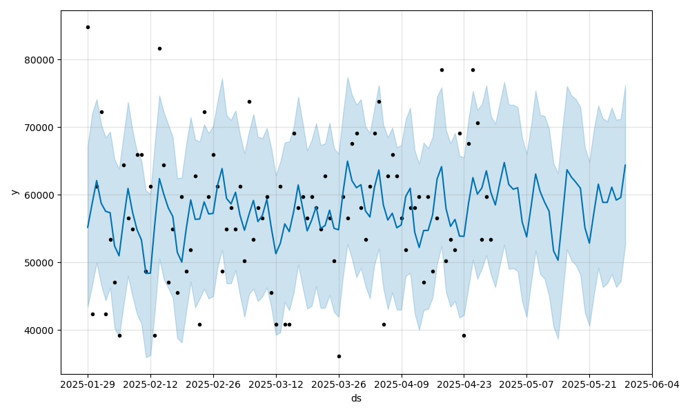
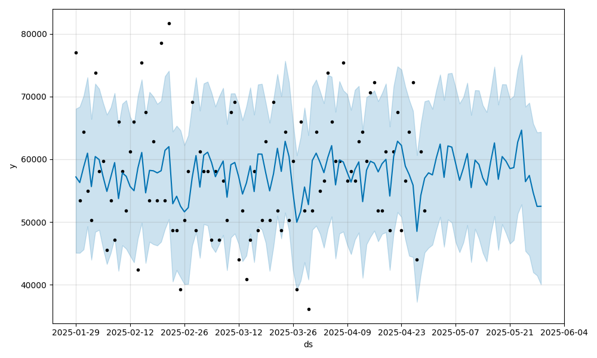
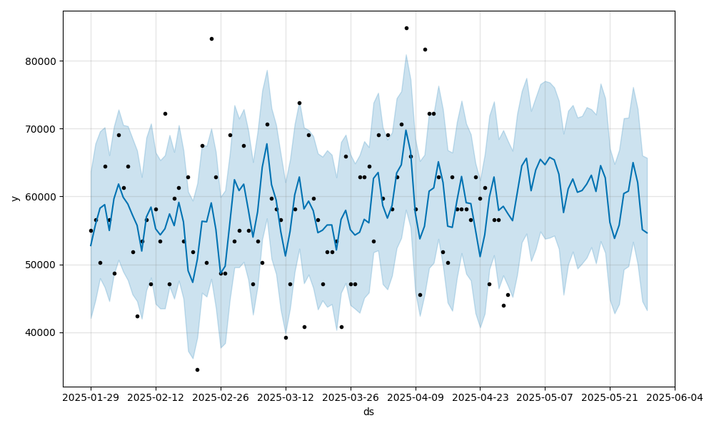
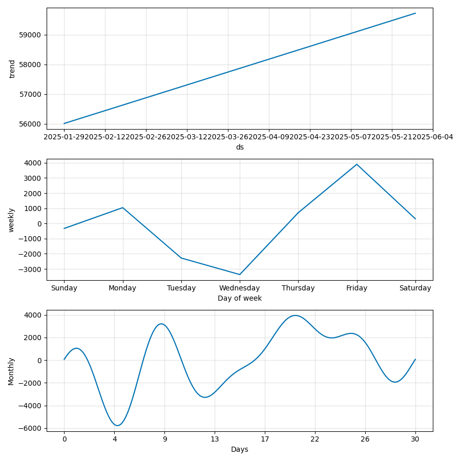
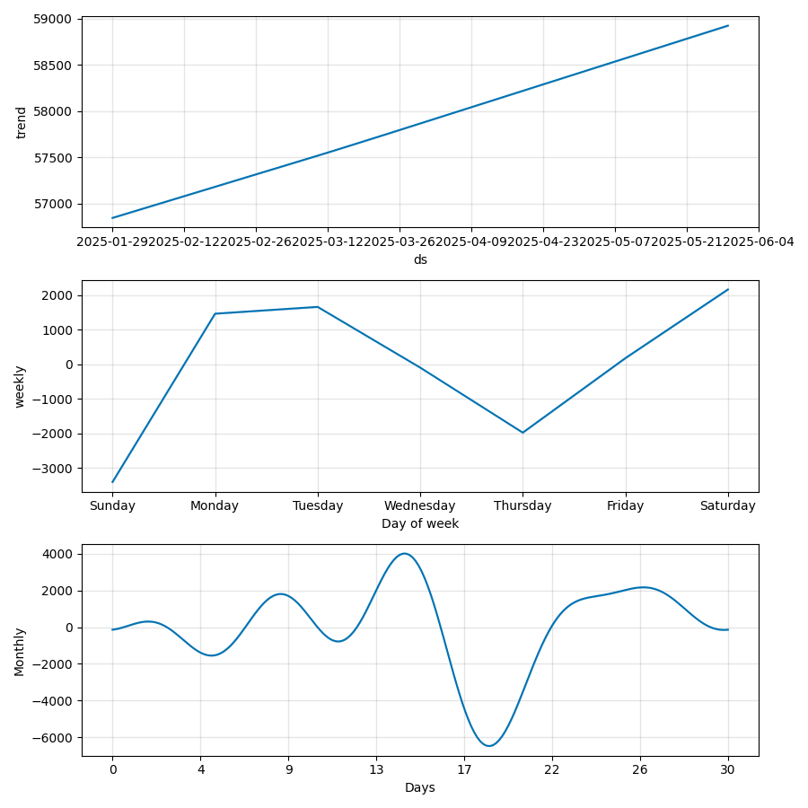
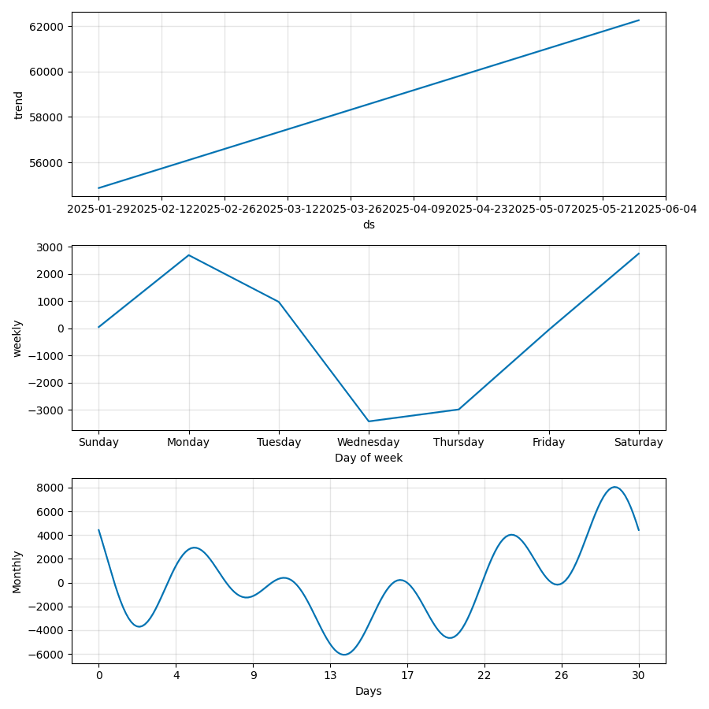

<div align="center">

# 📈 Sales Forecasting with Prophet

### Per-warehouse daily-sales forecasting with trend, seasonality & 30-day demand prediction

*Excel in, a trained Prophet model and forecast plots out — one model per warehouse.*


**Per-warehouse models · 30-day horizon · monthly seasonality · forecast + component plots**

</div>

---

> **A forecasting pipeline, not a dashboard.** Point it at your sales spreadsheets and it builds
> an independent [Facebook Prophet](https://facebook.github.io/prophet/) model **per warehouse**,
> projects the next 30 days of demand, and saves forecast and component plots as PNGs. No live UI,
> no database — clean, reproducible scripts you can drop into a reporting job.

## 🎯 What it is / What it's NOT

| ✅ What it **is** | ❌ What it's **NOT** |
|---|---|
| A **time-series forecasting** pipeline (Prophet) | A live BI **dashboard** or web app |
| **Per-warehouse** models with monthly seasonality | An ERP / inventory management system |
| **Reproducible** Excel → PNG scripts | A black-box "AI" recommender |
| **Demo-ready** with bundled dummy data | A real-time streaming/online forecaster |

## 🗺️ Pipeline

```mermaid
flowchart LR
    XL["📑 Excel files<br/>'Ventas por Tickets'"]:::src --> PL["🐻‍❄️ Polars<br/>read · merge · format dates"]:::clean
    PL --> SP["🗂️ Split by warehouse<br/>Almacén A · B · C …"]:::split
    SP --> AGG["➕ Group by date<br/>sum sales → ds / y"]:::agg
    AGG --> PR["🔮 Prophet<br/>monthly seasonality 30.5d · Fourier 5"]:::model
    PR --> FC["📈 Forecast +30 days<br/>+ component decomposition"]:::fc
    FC --> PNG["🖼️ PNG plots<br/>per warehouse"]:::out

    classDef src fill:#0ea5e9,stroke:#fff,color:#fff
    classDef clean fill:#CD792C,stroke:#fff,color:#fff
    classDef split fill:#6366f1,stroke:#fff,color:#fff
    classDef agg fill:#16a34a,stroke:#fff,color:#fff
    classDef model fill:#005571,stroke:#fff,color:#fff
    classDef fc fill:#f59e0b,stroke:#fff,color:#000
    classDef out fill:#8b5cf6,stroke:#fff,color:#fff
```



## 🖼️ Sample output

Generated from the bundled dummy dataset (3 warehouses). Run the demo to reproduce them.

### 30-day forecasts

<table>
  <tr>
    <td align="center"><b>Warehouse A</b></td>
    <td align="center"><b>Warehouse B</b></td>
    <td align="center"><b>Warehouse C</b></td>
  </tr>
  <tr>
    <td></td>
    <td></td>
    <td></td>
  </tr>
</table>

*Black dots = observed daily sales · blue line = Prophet fit/forecast · shaded band = uncertainty interval.*

### Trend & seasonality components

<table>
  <tr>
    <td align="center"><b>Warehouse A</b></td>
    <td align="center"><b>Warehouse B</b></td>
    <td align="center"><b>Warehouse C</b></td>
  </tr>
  <tr>
    <td></td>
    <td></td>
    <td></td>
  </tr>
</table>

## 🚀 Quick start

**Prerequisites:** Python 3.x.

```bash
# 1. Install dependencies
pip install -r requirements.txt

# 2a. Run the demo (uses bundled dummy data → ./output/demo/prophet/)
python demo/demo.py

# 2b. Run on your own data (reads ./data/sales/ → ./output/prophet/)
python src/main.py
```

> The first Prophet run compiles its Stan backend, which can take a minute.

## ⚙️ How it works

**Input columns** expected in the Excel files:

| Constant | Column (Spanish) | Role |
|---|---|---|
| `WAREHOUSE` | `Almacen` | Grouping key — one model per value |
| `DATE` | `Fecha` | Time axis → Prophet `ds` |
| `SALE_PRICE` | `PrecioVenta` | Target → summed per day → Prophet `y` |

**Key parameters** (set in [`src/main.py`](src/main.py) / [`demo/demo.py`](demo/demo.py)):

| Parameter | Value | Meaning |
|---|---|---|
| File keyword | `Ventas por Tickets` (prod) · `dummy` (demo) | Matches input filenames |
| Forecast horizon | `periods = 30` | Days projected into the future |
| Custom seasonality | `period = 30.5`, `fourier_order = 5` | Monthly cycle |
| Date format | `%Y-%m-%d` | Normalized before modeling |

## 🗂️ Project structure

```
SalesForecastingWithProphet/
├── src/
│   ├── main.py            # Production entry point (./data/sales → ./output/prophet)
│   ├── polarsUtils.py     # Excel I/O, merge, date formatting, split helpers
│   └── systemUtils.py     # Filesystem / path utilities
├── demo/
│   └── demo.py            # Demo entry point (dummy data → ./output/demo/prophet)
├── data/
│   └── dummy/
│       └── dummy_sales_data_10k.xlsx
├── output/
│   └── demo/prophet/      # Generated forecast & component PNGs
├── requirements.txt
└── LICENSE                # GNU GPLv3
```

## 🧰 Tech stack

| Purpose | Tool |
|---|---|
| Data processing | **Polars** (+ **PyArrow**) |
| Prophet interop | **pandas** |
| Forecasting | **Prophet 1.1.6** |
| Visualization | **Matplotlib** |
| Notebooks | **Jupyter** |

## 📄 License

Released under the **GNU General Public License v3.0** — see [`LICENSE`](LICENSE).

---

<div align="center">

Made by **[Gibran Ojeda](https://github.com/gibran-ojeda)** · `gibran.ojeda.7@gmail.com`

</div>
